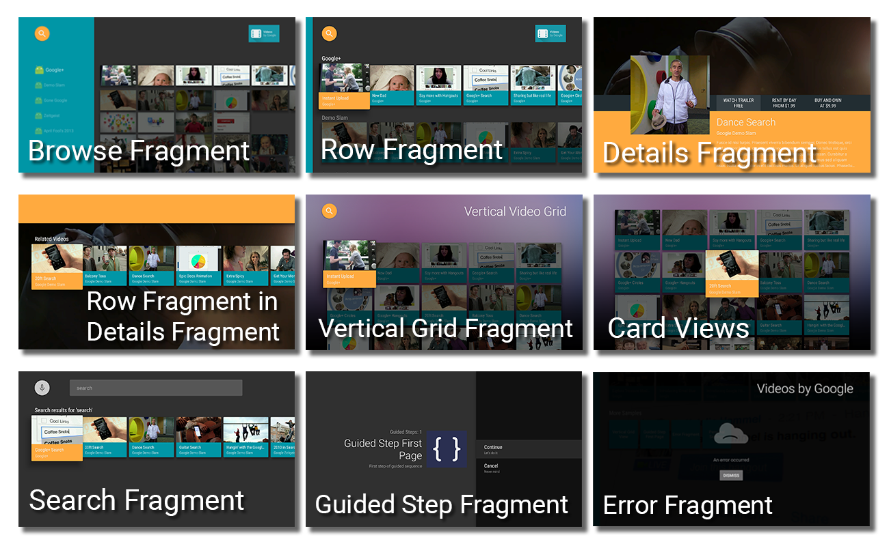

# Android TV Leanback Support Library sample - Videos by Google

[](https://gitter.im/googlesamples/androidtv-Leanback?utm_source=badge&utm_medium=badge&utm_campaign=pr-badge&utm_content=badge)

This sample is a Videos By Google app, designed to run on an Android TV device (such as the Nexus Player), which demonstrates how to use the Leanback Support library which enables you to easily develop beautiful Android TV apps with a user-friendly UI that complies with the UX guidelines of Android TV.

## Android N Preview / Picture-in-picture

The Android N Preview adds [Picture-in-picture][pip-docs] (PIP) to Android TV.

Picture-in-picture support is available directly on the `master` branch of this repo.

[pip-docs]: https://developer.android.com/preview/features/picture-in-picture.html

## Introduction

- [Read more about Android TV introduction](http://www.android.com/tv/)
- [Android TV Developer Documentation](http://developer.android.com/tv)
- [Android TV apps in Google Play Store][store-apps]

## Dependencies

If you use Android Studio as recommended, the following dependencies will **automatically** be installed by Gradle.

- Android SDK v7 appcompat library
- Android SDK v17 leanback support library
- Android SDK v7 recyclerview library

## Getting Started

- Clone this repo:

```sh
git clone https://github.com/googlesamples/androidtv-Leanback.git
```

- Open the project in [Android Studio][studio].
- Compile and deploy to your Android TV device (such as a Nexus Player).

Need more information about getting started with Android TV? Check the [official docs][getting-started].

## Screenshots

[](https://raw.githubusercontent.com/googlesamples/androidtv-Leanback/master/screenshots/atv-leanback-all.png)

## Support

If you need additional help, our community might be able to help.

- Android TV Google+ Community: [https://g.co/androidtvdev](https://g.co/androidtvdev)
- Stack Overflow: http://stackoverflow.com/questions/tagged/android-tv

## Contributing

We love contributions! :smile: Please follow the steps in the [CONTRIBUTING guide][contributing] to get started. If you found a bug, please file it [here][bugs].

## License

Licensed under the Apache 2.0 license. See the [LICENSE file][license] for details.

[store-apps]: https://play.google.com/store/apps/collection/promotion_3000e26_androidtv_apps_all
[studio]: https://developer.android.com/tools/studio/index.html
[getting-started]: https://developer.android.com/training/tv/start/start.html
[bugs]: https://github.com/googlesamples/androidtv-Leanback/issues/new
[contributing]: CONTRIBUTING.md
[license]: LICENSE
