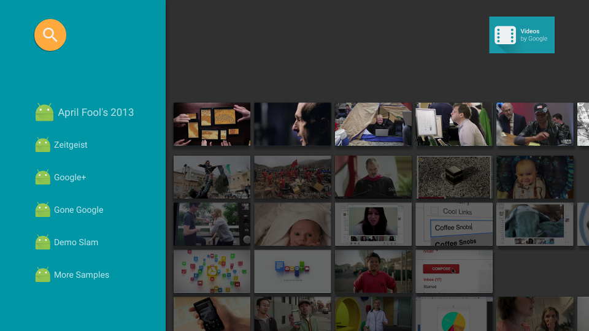

AndroidTV Leanback Support Library sample for videos
====================================================

The Leanback API Demo/Video By Googles app is designed to run on an Android TV device. It demonstrates how to use the Leanback Support library to develop Android TV apps with user friendly UI that will comply with the UX guidelines of Android TV.

Introduciton
------------

- [Read more about Android TV introduction](http://www.android.com/tv/)
- [Android TV Developer Documentation](http://developer.android.com/tv)
- [Android TV apps in Google Play Store](https://play.google.com/store/apps/collection/promotion_3000e26_androidtv_apps_all?hl=en)

Pre-requisites
--------------

* Android SDK v7 appcompat library
* Android SDK v17 leanback support library
* Android SDK v7 recyclerview library

Getting Started
---------------

- Fetch code by git clone https://github.com/googlesamples/androidtv-Leanback.git
- Open it in Android Studio
- Compile and deploy to your Android TV device.
- [More info about getting started](https://developer.android.com/training/tv/start/start.html)

Screenshots
-----------

Support
-------

- Android TV Google+ Community: [https://g.co/androidtvdev](https://g.co/androidtvdev)
- Stack Overflow: http://stackoverflow.com/questions/tagged/android-tv

License
-------
Licensed under the Apache 2.0 license. See the LICENSE file for details.

How to make contributions?
--------------------------
Please read and follow the steps in the CONTRIBUTING.md
